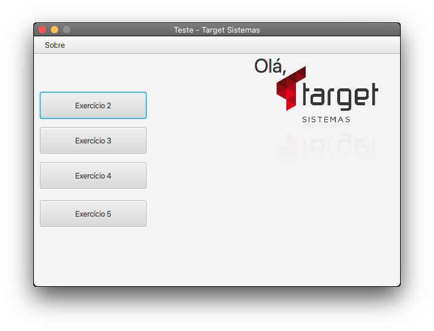

# Target test



📺 [Vídeo do programa em execução](https://www.youtube.com/watch?v=bafbWkRpUDM)

Resolução de teste aplicado pela empresa Target Sistemas. 

## 🚀 Descrição

O objetivo do target-test é apresentar as resoluções de quatro atividades de desenvolvimento, solicitadas pela empresa durante o seu processo seletivo.
A aplicação foi desenvolvida utilizando as tecnologias Java, JavaFX e Gson. 
A aplicação conta com um menu principal que dispõe acesso a resolução de cada uma das atividades solicitadas, com o intuito de tornar mais fácil a visualiação do avaliador.

###### Desafios

2. Dado a sequência de Fibonacci, onde se inicia por 0 e 1 e o próximo valor sempre será a soma dos 2 valores anteriores (exemplo: 0, 1, 1, 2, 3, 5, 8, 13, 21, 34...), escreva um programa na linguagem que desejar onde, informado um número, ele calcule a sequência de Fibonacci e retorne uma mensagem avisando se o número informado pertence ou não a sequência.

IMPORTANTE:
Esse número pode ser informado através de qualquer entrada de sua preferência ou pode ser previamente definido no código;

3. Dado um vetor que guarda o valor de faturamento diário de uma distribuidora, faça um programa, na linguagem que desejar, que calcule e retorne:

- O menor valor de faturamento ocorrido em um dia do mês;
- O maior valor de faturamento ocorrido em um dia do mês;
- Número de dias no mês em que o valor de faturamento diário foi superior à média mensal.

IMPORTANTE:
- [x] Usar o json ou xml disponível como fonte dos dados do faturamento mensal;
- [x] Podem existir dias sem faturamento, como nos finais de semana e feriados. Estes dias devem ser ignorados no cálculo da média;

4. Dado o valor de faturamento mensal de uma distribuidora, detalhado por Estado:

SP - R$ 67.836,43
RJ - R$ 36.678,66
MG - R$ 29.229,88
ES - R$ 27.165,48
Outros - R$ 19.849,53

Escreva um programa na linguagem que desejar onde calcule o percentual de representação que cada Estado teve dentro do valor total mensal da distribuidora.

5. Escreva um programa que inverta os caracteres de um string.

IMPORTANTE:
- [x] Essa string pode ser informada através de qualquer entrada de sua preferência ou pode ser previamente definida no código;
- [x] Evite utilizar métodos prontos, como por exemplo o reverse.


### 📋 Pré-requisitos

Para executar a aplicação via executável .Jar, é necessário que alguns pré-requisitos sejam atendidos:

1) Ter o Java JDK instalado no sistema operacional;

* [Java JDK](https://www.azul.com/downloads/#download-openjdk) - O Java JDK utilizado foi o Java Zulu community 

2) Ter a biblioteca do JavaFX JDK versão 18.0.1 instalada no sistema operacional;

* [JavaFX JDK](https://gluonhq.com/products/javafx/) - O JavaFX JDK utilizado foi o JavaFX Gluon community 


### 🔧 Instalação

1) Instale o Java JDK e configure sua variável de ambiente de acordo com o seu sistema operacional;
2) Após realizado o download da biblioteca do JavaFX JDK:
No Windows: crie uma pasta na unidade C: com o nome javafx e extraia o arquivo compactado para ela.
No MacOS ou Linux: crie uma pasta em Documentos com o nome javafx e extraia o arquivo compactado para ela.
Atenção: O caminho desta pasta será utilizado no comando para executar a aplicação;
3) Faça o download do arquivo executável target-test.jar e salve em sua área de trabalho;

* [target-test-app.jar](https://drive.google.com/file/d/1kARSSTSYuwqZJTr9UZX_rrXhkC3wdkqQ/view?usp=sharing) - Executável target-test-app.jar no google drive 

Para executar o target-test-app.jar é necessário que o argumento seja executado via terminal:
OBS: O arquivo target-test-app.jar deve estar salvo na área de trabalho.

No MacOs:

```
cd Desktop
java --module-path /Users/SEU-USUARIO-NO-MAC/PASTA-DA-BIBLIOTECA-JAVAFX/javafx-sdk-18.0.1/lib/ --add-modules javafx.controls,javafx.fxml -cp target-test-app.jar application.Main

```

No Windows:

```
cd Desktop
java --module-path C:\Users<SEU-USUARIO-NO-WINDOWS>\PASTA-DA-BIBLIOTECA-JAVAFX\javafx-sdk-18.0.1\lib --add-modules=javafx.controls,javafx.fxml -cp target-test-app.jar application.Main
```

O sistema operacional utilizado durante o desenvolvimento foi o MacOS, por este motivo alguns campos como labels e textfields podem sofrer distorções gráficas quando executada a aplicação em outros sistemas operacionais. Isso não afetará os resultados da aplicação.


---
[Linkedin](https://www.linkedin.com/in/wellitonfernandes/) 😊